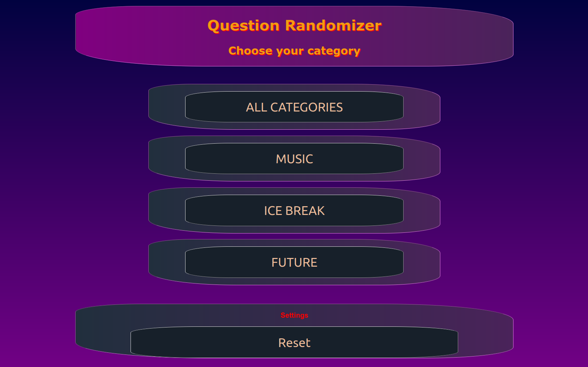
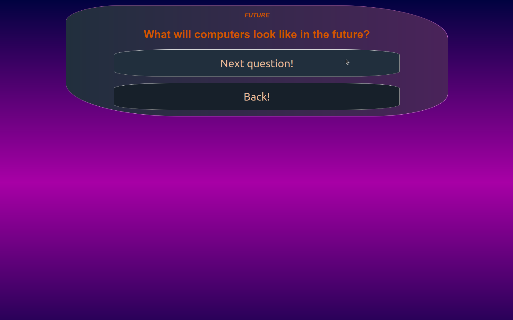
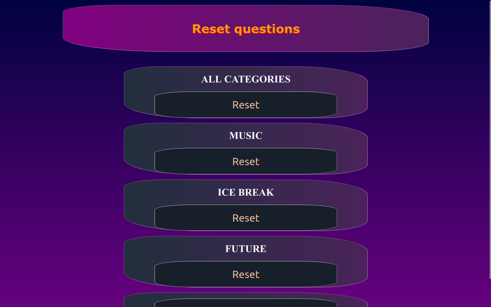

# QuestionRandomizer

## What was the purpose of writing this program
Improving spring-boot and frontend skills and creating something a bit more complex than my recent projects

## What it can do and what do you need
It can be an app to use at a party with friends. The app draws questions from a pool of questions. Each question has its own category by which you can also draw. As long as there are questions in the pool, the questions will not be repeated. If the questions run out, they will be reset automatically. The questions are loaded from the src/resources/static/questions/ folder. All .txt files from there will be read. The filename will be the category. Each subsequent line is another question. To run, open the console in the directory with the pom.xml file and enter "mvn clean install" and then "mvn spring-boot:run".

_Main page_ \

_Question Page_ \

_Reset Page_ \
